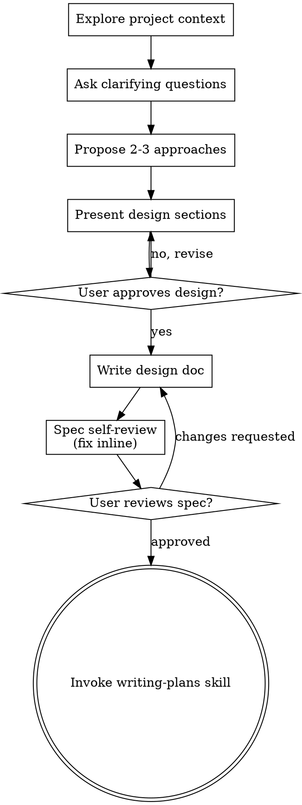

# Custom domain for GitHub Pages personal site

**Session ID:** ses_0b871d961ffeWcUWcQ3QzqQLn8
**Created:** 7/9/2026, 10:45:26 PM
**Updated:** 7/9/2026, 10:59:36 PM

---

## User

i want to build a personal website or blog and deployed it on github with custom domain name, is it possible?

---

## Assistant (Build · mimo/mimo-v2.5-pro · 4.6s)

_Thinking:_

The user is asking about building a personal website/blog and deploying it on GitHub with a custom domain name. This is a question about possibilities and planning, not a coding task yet.

Let me check if any skills apply here. Looking at the available skills:
- brainstorming - "You MUST use this before any creative work - creating features, building components, adding functionality, or modifying behavior. Explores user intent, requirements and design before implementation."

This seems to match because the user is exploring building a new personal website/blog. Let me use the brainstorming skill first.

**Tool: skill**

**Input:**
```json
{
  "name": "brainstorming"
}
```

**Output:**
```
<skill_content name="brainstorming">
# Skill: brainstorming

# Brainstorming Ideas Into Designs

Help turn ideas into fully formed designs and specs through natural collaborative dialogue.

Start by understanding the current project context, then ask questions one at a time to refine the idea. Once you understand what you're building, present the design and get user approval.

<HARD-GATE>
Do NOT invoke any implementation skill, write any code, scaffold any project, or take any implementation action until you have presented a design and the user has approved it. This applies to EVERY project regardless of perceived simplicity.
</HARD-GATE>

## Anti-Pattern: "This Is Too Simple To Need A Design"

Every project goes through this process. A todo list, a single-function utility, a config change — all of them. "Simple" projects are where unexamined assumptions cause the most wasted work. The design can be short (a few sentences for truly simple projects), but you MUST present it and get approval.

## Checklist

You MUST create a task for each of these items and complete them in order:

1. **Explore project context** — check files, docs, recent commits
2. **Offer the visual companion just-in-time** — NOT upfront. The first time a question would genuinely be clearer shown than described, offer it then (its own message); on approval its browser tab opens for you. If no visual question ever arises, never offer it. See the Visual Companion section below.
3. **Ask clarifying questions** — one at a time, understand purpose/constraints/success criteria
4. **Propose 2-3 approaches** — with trade-offs and your recommendation
5. **Present design** — in sections scaled to their complexity, get user approval after each section
6. **Write design doc** — save to `docs/superpowers/specs/YYYY-MM-DD-<topic>-design.md` and commit
7. **Spec self-review** — quick inline check for placeholders, contradictions, ambiguity, scope (see below)
8. **User reviews written spec** — ask user to review the spec file before proceeding
9. **Transition to implementation** — invoke writing-plans skill to create implementation plan

## Process Flow



**The terminal state is invoking writing-plans.** Do NOT invoke frontend-design, mcp-builder, or any other implementation skill. The ONLY skill you invoke after brainstorming is writing-plans.

## The Process

**Understanding the idea:**

- Check out the current project state first (files, docs, recent commits)
- Before asking detailed questions, assess scope: if the request describes multiple independent subsystems (e.g., "build a platform with chat, file storage, billing, and analytics"), flag this immediately. Don't spend questions refining details of a project that needs to be decomposed first.
- If the project is too large for a single spec, help the user decompose into sub-projects: what are the independent pieces, how do they relate, what order should they be built? Then brainstorm the first sub-project through the normal design flow. Each sub-project gets its own spec → plan → implementation cycle.
- For appropriately-scoped projects, ask questions one at a time to refine the idea
- Prefer multiple choice questions when possible, but open-ended is fine too
- Only one question per message - if a topic needs more exploration, break it into multiple questions
- Focus on understanding: purpose, constraints, success criteria

**Exploring approaches:**

- Propose 2-3 different approaches with trade-offs
- Present options conversationally with your recommendation and reasoning
- Lead with your recommended option and explain why

**Presenting the design:**

- Once you believe you understand what you're building, present the design
- Scale each section to its complexity: a few sentences if straightforward, up to 200-300 words if nuanced
- Ask after each section whether it looks right so far
- Cover: architecture, components, data flow, error handling, testing
- Be ready to go back and clarify if something doesn't make sense

**Design for isolation and clarity:**

- Break the system into smaller units that each have one clear purpose, communicate through well-defined interfaces, and can be understood and tested independently
- For each unit, you should be able to answer: what does it do, how do you use it, and what does it depend on?
- Can someone understand what a unit does without reading its internals? Can you change the internals without breaking consumers? If not, the boundaries need work.
- Smaller, well-bounded units are also easier for you to work with - you reason better about code you can hold in context at once, and your edits are more reliable when files are focused. When a file grows large, that's often a signal that it's doing too much.

**Working in existing codebases:**

- Explore the current structure before proposing changes. Follow existing patterns.
- Where existing code has problems that affect the work (e.g., a file that's grown too large, unclear boundaries, tangled responsibilities), include targeted improvements as part of the design - the way a good developer improves code they're working in.
- Don't propose unrelated refactoring. Stay focused on what serves the current goal.

## After the Design

**Documentation:**

- Write the validated design (spec) to `docs/superpowers/specs/YYYY-MM-DD-<topic>-design.md`
  - (User preferences for spec location override this default)
- Use elements-of-style:writing-clearly-and-concisely skill if available
- Commit the design document to git

**Spec Self-Review:**
After writing the spec document, look at it with fresh eyes:

1. **Placeholder scan:** Any "TBD", "TODO", incomplete sections, or vague requirements? Fix them.
2. **Internal consistency:** Do any sections contradict each other? Does the architecture match the feature descriptions?
3. **Scope check:** Is this focused enough for a single implementation plan, or does it need decomposition?
4. **Ambiguity check:** Could any requirement be interpreted two different ways? If so, pick one and make it explicit.

Fix any issues inline. No need to re-review — just fix and move on.

**User Review Gate:**
After the spec review loop passes, ask the user to review the written spec before proceeding:

> "Spec written and committed to `<path>`. Please review it and let me know if you want to make any changes before we start writing out the implementation plan."

Wait for the user's response. If they request changes, make them and re-run the spec review loop. Only proceed once the user approves.

**Implementation:**

- Invoke the writing-plans skill to create a detailed implementation plan
- Do NOT invoke any other skill. writing-plans is the next step.

## Key Principles

- **One question at a time** - Don't overwhelm with multiple questions
- **Multiple choice preferred** - Easier to answer than open-ended when possible
- **YAGNI ruthlessly** - Remove unnecessary features from all designs
- **Explore alternatives** - Always propose 2-3 approaches before settling
- **Incremental validation** - Present design, get approval before moving on
- **Be flexible** - Go back and clarify when something doesn't make sense

## Visual Companion

A browser-based companion for showing mockups, diagrams, and visual options during brainstorming. Available as a tool — not a mode. Accepting the companion means it's available for questions that benefit from visual treatment; it does NOT mean every question goes through the browser.

**Offering the companion (just-in-time):** Do NOT offer it upfront. Wait until a question would genuinely be clearer shown than told — a real mockup / layout / diagram question, not merely a UI *topic*. The first time that happens, offer it then, as its own message:
> "This next part might be easier if I show you — I can put together mockups, diagrams, and comparisons in a browser tab as we go. It's still new and can be token-intensive. Want me to? I'll open it for you."

**This offer MUST be its own message.** Only the offer — no clarifying question, summary, or other content. Wait for the user's response. If they accept, start the server with `--open` so their browser opens to the first screen automatically. If they decline, continue text-only and don't offer again unless they raise it.

**Per-question decision:** Even after the user accepts, decide FOR EACH QUESTION whether to use the browser or the terminal. The test: **would the user understand this better by seeing it than reading it?**

- **Use the browser** for content that IS visual — mockups, wireframes, layout comparisons, architecture diagrams, side-by-side visual designs
- **Use the terminal** for content that is text — requirements questions, conceptual choices, tradeoff lists, A/B/C/D text options, scope decisions

A question about a UI topic is not automatically a visual question. "What does personality mean in this context?" is a conceptual question — use the terminal. "Which wizard layout works better?" is a visual question — use the browser.

If they agree to the companion, read the detailed guide before proceeding:
`skills/brainstorming/visual-companion.md`

Base directory for this skill: /home/upi/.cache/opencode/packages/superpowers@git+https:/github.com/obra/superpowers.git/node_modules/superpowers/skills/brainstorming
Relative paths in this skill (e.g., scripts/, reference/) are relative to this base directory.
Note: file list is sampled.

<skill_files>
<file>/home/upi/.cache/opencode/packages/superpowers@git+https:/github.com/obra/superpowers.git/node_modules/superpowers/skills/brainstorming/visual-companion.md</file>
<file>/home/upi/.cache/opencode/packages/superpowers@git+https:/github.com/obra/superpowers.git/node_modules/superpowers/skills/brainstorming/spec-document-reviewer-prompt.md</file>
<file>/home/upi/.cache/opencode/packages/superpowers@git+https:/github.com/obra/superpowers.git/node_modules/superpowers/skills/brainstorming/scripts/helper.js</file>
<file>/home/upi/.cache/opencode/packages/superpowers@git+https:/github.com/obra/superpowers.git/node_modules/superpowers/skills/brainstorming/scripts/stop-server.sh</file>
<file>/home/upi/.cache/opencode/packages/superpowers@git+https:/github.com/obra/superpowers.git/node_modules/superpowers/skills/brainstorming/scripts/server.cjs</file>
<file>/home/upi/.cache/opencode/packages/superpowers@git+https:/github.com/obra/superpowers.git/node_modules/superpowers/skills/brainstorming/scripts/frame-template.html</file>
<file>/home/upi/.cache/opencode/packages/superpowers@git+https:/github.com/obra/superpowers.git/node_modules/superpowers/skills/brainstorming/scripts/start-server.sh</file>
</skill_files>
</skill_content>
```

---

## Assistant (Build · mimo/mimo-v2.5-pro · 9.3s)

_Thinking:_

The user is asking about building a personal website/blog and deploying it on GitHub with a custom domain. This is a brainstorming task - they want to explore building something new. Let me follow the brainstorming skill.

Let me create the todo list first, then start with step 1: explore project context.

The current workspace is /home/upi/sandbox and it's not a git repo. Let me check what's in there.

Using **brainstorming** to explore your personal website/blog idea.

**Tool: todowrite**

**Input:**
```json
{
  "todos": [
    {
      "content": "Explore project context — check current workspace state",
      "status": "in_progress",
      "priority": "high"
    },
    {
      "content": "Ask clarifying questions — purpose, tech stack, style, features",
      "status": "pending",
      "priority": "high"
    },
    {
      "content": "Propose 2-3 approaches with trade-offs",
      "status": "pending",
      "priority": "high"
    },
    {
      "content": "Present design and get user approval",
      "status": "pending",
      "priority": "high"
    },
    {
      "content": "Write design doc",
      "status": "pending",
      "priority": "medium"
    },
    {
      "content": "Spec self-review",
      "status": "pending",
      "priority": "medium"
    },
    {
      "content": "User reviews spec",
      "status": "pending",
      "priority": "medium"
    },
    {
      "content": "Transition to implementation planning",
      "status": "pending",
      "priority": "low"
    }
  ]
}
```

**Output:**
```
[
  {
    "content": "Explore project context — check current workspace state",
    "status": "in_progress",
    "priority": "high"
  },
  {
    "content": "Ask clarifying questions — purpose, tech stack, style, features",
    "status": "pending",
    "priority": "high"
  },
  {
    "content": "Propose 2-3 approaches with trade-offs",
    "status": "pending",
    "priority": "high"
  },
  {
    "content": "Present design and get user approval",
    "status": "pending",
    "priority": "high"
  },
  {
    "content": "Write design doc",
    "status": "pending",
    "priority": "medium"
  },
  {
    "content": "Spec self-review",
    "status": "pending",
    "priority": "medium"
  },
  {
    "content": "User reviews spec",
    "status": "pending",
    "priority": "medium"
  },
  {
    "content": "Transition to implementation planning",
    "status": "pending",
    "priority": "low"
  }
]
```

---

## Assistant (Build · mimo/mimo-v2.5-pro · 2.9s)

_Thinking:_

Let me check the current workspace state first.

**Tool: read**

**Input:**
```json
{
  "filePath": "/home/upi/sandbox"
}
```

**Output:**
```
<path>/home/upi/sandbox</path>
<type>directory</type>
<entries>
ansible-labs/
astro-cms-poc/
cka/
console/
datacamp-clone/
docmost-poc/
fumadocs-payload-poc/
gitbook/
hermes/
nextra-cms-poc/
okd-lite/
ollama/
outline-poc/
pcf-multi-foundation-console/
sre-go-labs/
sre-observability-lab/
sre-python-labs/
TF-PREP-FLOCI/

(18 entries)
</entries>
```

---

## Assistant (Build · mimo/mimo-v2.5-pro · 6.2s)

_Thinking:_

The workspace has various projects. The user wants to build a personal website/blog. Let me now ask the first clarifying question. I need to understand their purpose and preferences before proposing approaches.

First question should be about what kind of content they want to publish and what their technical comfort level is.

**Tool: todowrite**

**Input:**
```json
{
  "todos": [
    {
      "content": "Explore project context — check current workspace state",
      "priority": "high",
      "status": "completed"
    },
    {
      "content": "Ask clarifying questions — purpose, tech stack, style, features",
      "priority": "high",
      "status": "in_progress"
    },
    {
      "content": "Propose 2-3 approaches with trade-offs",
      "priority": "high",
      "status": "pending"
    },
    {
      "content": "Present design and get user approval",
      "priority": "high",
      "status": "pending"
    },
    {
      "content": "Write design doc",
      "priority": "medium",
      "status": "pending"
    },
    {
      "content": "Spec self-review",
      "priority": "medium",
      "status": "pending"
    },
    {
      "content": "User reviews spec",
      "priority": "medium",
      "status": "pending"
    },
    {
      "content": "Transition to implementation planning",
      "priority": "low",
      "status": "pending"
    }
  ]
}
```

**Output:**
```
[
  {
    "content": "Explore project context — check current workspace state",
    "status": "completed",
    "priority": "high"
  },
  {
    "content": "Ask clarifying questions — purpose, tech stack, style, features",
    "status": "in_progress",
    "priority": "high"
  },
  {
    "content": "Propose 2-3 approaches with trade-offs",
    "status": "pending",
    "priority": "high"
  },
  {
    "content": "Present design and get user approval",
    "status": "pending",
    "priority": "high"
  },
  {
    "content": "Write design doc",
    "status": "pending",
    "priority": "medium"
  },
  {
    "content": "Spec self-review",
    "status": "pending",
    "priority": "medium"
  },
  {
    "content": "User reviews spec",
    "status": "pending",
    "priority": "medium"
  },
  {
    "content": "Transition to implementation planning",
    "status": "pending",
    "priority": "low"
  }
]
```

---

## Assistant (Build · mimo/mimo-v2.5-pro · 9.5s)

_Thinking:_

I see the user has several projects in their workspace, including some that look like blog/CMS related projects (nextra-cms-poc, fumadocs-payload-poc, outline-poc, etc.). This suggests they have some experience with different CMS solutions. Let me ask the first clarifying question about what type of content and their technical preferences.

**Yes, absolutely possible!** GitHub Pages + custom domain is a popular and free way to host a personal site.

I see you already have some CMS-related projects in your workspace (nextra-cms-poc, fumadocs-payload-poc, outline-poc). Before I propose approaches, let me understand what you're looking for:

**What's the primary purpose of this site?**

1. **Blog-focused** — mostly writing articles/posts, minimal other pages
2. **Portfolio + blog** — showcase projects/work alongside blog posts
3. **Personal brand site** — landing page, about, contact, with a blog section
4. **Documentation/knowledge base** — sharing technical knowledge (like your SRE/DevOps work)

---

## User

2

---

## Assistant (Build · mimo/mimo-v2.5-pro · 4.2s)

_Thinking:_

The user chose option 2: Portfolio + blog. Let me ask the next question about their technical preferences.

Got it — portfolio + blog. Next question:

**Which tech stack do you prefer?**

1. **Astro** — fast, content-focused, great for blogs/portfolios, uses Markdown (Recommended)
2. **Next.js** — React-based, full-stack capable, more complex but flexible
3. **Hugo** — Go-based static site generator, extremely fast builds, Markdown content
4. **Plain HTML/CSS** — full control, no framework, simplest setup

---

## User

1

---

## Assistant (Build · mimo/mimo-v2.5-pro · 7.0s)

_Thinking:_

The user chose Astro. Let me ask about design style preferences.

Astro is a great choice for this. Next:

**What visual style do you prefer?**

1. **Minimal/clean** — lots of whitespace, typography-focused, simple layouts
2. **Dark mode first** — dark backgrounds, modern tech aesthetic
3. **Colorful/creative** — bold colors, illustrations, personality-driven
4. **Professional/corporate** — structured, trustworthy, business-like

---

## User

minimal/clean & professional

---

## Assistant (Build · mimo/mimo-v2.5-pro · 4.9s)

_Thinking:_

The user wants minimal/clean and professional. Let me ask about features for the blog.

Nice combo. Next:

**What blog features matter most to you?**

1. **Basic** — title, date, tags, markdown posts, RSS feed
2. **Enhanced** — basic + categories, search, reading time, table of contents
3. **Full-featured** — enhanced + comments, social sharing, related posts, newsletter signup

---

## User

2

---

## Assistant (Build · mimo/mimo-v2.5-pro · 7.4s)

_Thinking:_

The user wants enhanced blog features. Let me ask about the custom domain they have or plan to use.

Good choice. One more:

**Do you already have a custom domain name, or need help choosing one?**

1. **I have a domain** — I'll tell you what it is
2. **Need to buy one** — I want recommendations
3. **Not sure yet** — I'll figure it out later, just build the site first

---

## User

1

---

## Assistant (Build · mimo/mimo-v2.5-pro · 3.2s)

_Thinking:_

The user has a domain. Let me ask them what it is so I can include it in the design.

What's your domain name? (e.g., `yourname.com`)

---

## User

azemoning.com

---

## Assistant (Build · mimo/mimo-v2.5-pro · 11.2s)

_Thinking:_

Now I have enough information to propose approaches and present a design. Let me summarize what I know:

- **Purpose:** Portfolio + blog
- **Tech stack:** Astro
- **Visual style:** Minimal/clean + professional
- **Blog features:** Enhanced (categories, search, reading time, table of contents)
- **Domain:** azemoning.com

Now I should propose 2-3 approaches and then present a design. Let me think about the approaches:

1. **Astro with a pre-built theme** — fastest to set up, less customization
2. **Astro from scratch with Tailwind** — more control, moderate effort
3. **Astro + a CMS (like Sanity/Contentful)** — easier content management but adds complexity

For a portfolio + blog with enhanced features, I'd recommend Astro + Tailwind with a clean theme as a starting point. Let me present the approaches to the user.

**Tool: todowrite**

**Input:**
```json
{
  "todos": [
    {
      "content": "Explore project context — check current workspace state",
      "priority": "high",
      "status": "completed"
    },
    {
      "content": "Ask clarifying questions — purpose, tech stack, style, features",
      "priority": "high",
      "status": "completed"
    },
    {
      "content": "Propose 2-3 approaches with trade-offs",
      "priority": "high",
      "status": "in_progress"
    },
    {
      "content": "Present design and get user approval",
      "priority": "high",
      "status": "pending"
    },
    {
      "content": "Write design doc",
      "priority": "medium",
      "status": "pending"
    },
    {
      "content": "Spec self-review",
      "priority": "medium",
      "status": "pending"
    },
    {
      "content": "User reviews spec",
      "priority": "medium",
      "status": "pending"
    },
    {
      "content": "Transition to implementation planning",
      "priority": "low",
      "status": "pending"
    }
  ]
}
```

**Output:**
```
[
  {
    "content": "Explore project context — check current workspace state",
    "status": "completed",
    "priority": "high"
  },
  {
    "content": "Ask clarifying questions — purpose, tech stack, style, features",
    "status": "completed",
    "priority": "high"
  },
  {
    "content": "Propose 2-3 approaches with trade-offs",
    "status": "in_progress",
    "priority": "high"
  },
  {
    "content": "Present design and get user approval",
    "status": "pending",
    "priority": "high"
  },
  {
    "content": "Write design doc",
    "status": "pending",
    "priority": "medium"
  },
  {
    "content": "Spec self-review",
    "status": "pending",
    "priority": "medium"
  },
  {
    "content": "User reviews spec",
    "status": "pending",
    "priority": "medium"
  },
  {
    "content": "Transition to implementation planning",
    "status": "pending",
    "priority": "low"
  }
]
```

---

## Assistant (Build · mimo/mimo-v2.5-pro · 8.9s)

_Thinking:_

Now let me propose 2-3 approaches for building this site.

Here are **3 approaches** for your Astro portfolio + blog:

---

### **Option A: Astro + Tailwind (Recommended)**

Build from a minimal starter, use Tailwind CSS for styling.

**Pros:**
- Full control over design
- Clean, professional look with minimal effort
- Fast builds, lightweight output
- Easy to maintain and customize

**Cons:**
- Slightly more setup than a pre-built theme
- Need to build some components yourself

---

### **Option B: Astro + Pre-built Theme**

Use an existing Astro theme like `Astro Nano` or `Astro Paper`.

**Pros:**
- Fastest to get started
- Already has blog, categories, tags built-in
- Polished design out of the box

**Cons:**
- Less customization flexibility
- May need to remove unwanted features

---

### **Option C: Astro + Headless CMS (Sanity/Contentful)**

Use a CMS for content management, Astro for the frontend.

**Pros:**
- Easy content editing via web UI
- Good for non-technical content updates
- Content stored in a database

**Cons:**
- Adds complexity and external dependency
- Overkill for a personal site
- Requires API keys and more setup

---

**My recommendation: Option A (Astro + Tailwind)** — it gives you the clean, professional look you want with full control. You'll learn the stack while keeping it simple. The enhanced features (categories, search, reading time, TOC) are straightforward to implement.

Which approach do you prefer?

---

## User

do with A

---

## Assistant (Build · mimo/mimo-v2.5-pro · 11.0s)

_Thinking:_

The user chose Option A (Astro + Tailwind). Now I should present the design in sections and get user approval. Let me structure the design:

1. **Site Structure** — pages and navigation
2. **Portfolio Section** — how projects are displayed
3. **Blog Section** — enhanced features (categories, search, reading time, TOC)
4. **Styling/Design** — minimal/clean + professional aesthetic
5. **Technical Setup** — Astro + Tailwind, GitHub Pages, custom domain

Let me present this in sections.

**Tool: todowrite**

**Input:**
```json
{
  "todos": [
    {
      "content": "Explore project context — check current workspace state",
      "priority": "high",
      "status": "completed"
    },
    {
      "content": "Ask clarifying questions — purpose, tech stack, style, features",
      "priority": "high",
      "status": "completed"
    },
    {
      "content": "Propose 2-3 approaches with trade-offs",
      "priority": "high",
      "status": "completed"
    },
    {
      "content": "Present design and get user approval",
      "priority": "high",
      "status": "in_progress"
    },
    {
      "content": "Write design doc",
      "priority": "medium",
      "status": "pending"
    },
    {
      "content": "Spec self-review",
      "priority": "medium",
      "status": "pending"
    },
    {
      "content": "User reviews spec",
      "priority": "medium",
      "status": "pending"
    },
    {
      "content": "Transition to implementation planning",
      "priority": "low",
      "status": "pending"
    }
  ]
}
```

**Output:**
```
[
  {
    "content": "Explore project context — check current workspace state",
    "status": "completed",
    "priority": "high"
  },
  {
    "content": "Ask clarifying questions — purpose, tech stack, style, features",
    "status": "completed",
    "priority": "high"
  },
  {
    "content": "Propose 2-3 approaches with trade-offs",
    "status": "completed",
    "priority": "high"
  },
  {
    "content": "Present design and get user approval",
    "status": "in_progress",
    "priority": "high"
  },
  {
    "content": "Write design doc",
    "status": "pending",
    "priority": "medium"
  },
  {
    "content": "Spec self-review",
    "status": "pending",
    "priority": "medium"
  },
  {
    "content": "User reviews spec",
    "status": "pending",
    "priority": "medium"
  },
  {
    "content": "Transition to implementation planning",
    "status": "pending",
    "priority": "low"
  }
]
```

---

## Assistant (Build · mimo/mimo-v2.5-pro · 4.0s)

_Thinking:_

Now let me present the design in sections. I'll present each section and get approval.

Great choice! Let me present the design section by section.

---

## **Section 1: Site Structure**

**Pages:**
- `/` — Home (hero + featured projects + recent posts)
- `/about` — About you (bio, skills, contact info)
- `/projects` — Portfolio grid (project cards with images, tags, links)
- `/blog` — Blog index (posts with categories, search, filters)
- `/blog/[slug]` — Individual blog post (TOC, reading time, tags)

**Navigation:**
- Sticky top nav: Logo/name | Projects | Blog | About
- Footer: social links, copyright, RSS link

**Does this structure look right? Anything to add or remove?**

---

## User

lgtm

---

## Assistant (Build · mimo/mimo-v2.5-pro · 5.3s)

_Thinking:_

The user approved Section 1. Let me move to Section 2: Portfolio Section design.

## **Section 2: Portfolio Section**

**Layout:** Grid of project cards (3 columns on desktop, 1 on mobile)

**Each project card includes:**
- Project thumbnail/screenshot
- Project title
- Short description (1-2 sentences)
- Tech stack tags (e.g., `Go`, `Kubernetes`, `Terraform`)
- Links: Live demo (if any) | GitHub repo

**Project data stored in:** `src/data/projects.json` — easy to add/edit projects without touching code.

**Example card:**
```
┌─────────────────────────┐
│ [Screenshot]            │
│                         │
│ SRE Observability Lab   │
│ Monitoring stack with   │
│ Prometheus & Grafana    │
│                         │
│ [Go] [Docker] [K8s]    │
│                         │
│ GitHub │ Live Demo      │
└─────────────────────────┘
```

**Does this work for your portfolio?**

---

## User

lgtm

---

## Assistant (Build · mimo/mimo-v2.5-pro · 5.1s)

_Thinking:_

The user approved Section 2. Let me move to Section 3: Blog Section design with enhanced features.

## **Section 3: Blog Section**

**Blog index page:**
- Search bar at top (client-side, no external service)
- Category filter buttons (e.g., `SRE`, `DevOps`, `Kubernetes`, `Go`)
- Post list: title | date | category | reading time
- Pagination (10 posts per page)

**Individual post page:**
- Title, author, date, reading time
- Category + tags displayed
- Table of contents (auto-generated from headings, sticky sidebar on desktop)
- Markdown content with syntax highlighting for code blocks
- Related posts section at bottom (same category)

**Blog content stored in:** `src/content/blog/` as Markdown files with frontmatter:
```yaml
---
title: "Setting Up Prometheus Monitoring"
date: 2025-01-15
category: "SRE"
tags: ["prometheus", "monitoring", "observability"]
readingTime: "5 min read"
---
```

**RSS feed** auto-generated from blog posts.

**Does this blog design work for you?**

---

## User

can we add more rich frontmatter?

---

## Assistant (Build · mimo/mimo-v2.5-pro · 6.9s)

_Thinking:_

The user wants richer frontmatter. Let me suggest additional fields that would be useful for a professional blog/portfolio.

Absolutely! Here's an enhanced frontmatter schema:

```yaml
---
title: "Setting Up Prometheus Monitoring"
slug: "setting-up-prometheus-monitoring"  # custom URL slug (optional)
date: 2025-01-15
lastUpdated: 2025-03-20                  # for revision tracking
category: "SRE"
tags: ["prometheus", "monitoring", "observability"]
readingTime: "5 min read"
excerpt: "A practical guide to setting up Prometheus for production monitoring."  # used in cards/SEO
coverImage: "/images/blog/prometheus-setup.jpg"  # OG image + post header
draft: true                              # hide from production
author:                                  # if you ever have guest posts
  name: "Azemoning"
  url: "https://azemoning.com"
series: "Monitoring Fundamentals"        # for multi-part posts
difficulty: "intermediate"               # beginner/intermediate/advanced
canonical: "https://dev.to/your-post"    # for cross-posted content
---
```

**New fields explained:**
- `slug` — override auto-generated URL
- `lastUpdated` — shows revision date on the post
- `excerpt` — short summary for cards + meta description
- `coverImage` — featured image for OG/social + post header
- `draft` — true = hidden in production, visible in dev
- `author` — future-proof for guest posts
- `series` — groups related posts together
- `difficulty` — skill level indicator
- `canonical` — SEO for cross-posted content

**Does this cover your needs, or want to add anything else?**

---

## User

all of the schema except the coverimage, author, and difficulty

---

## Assistant (Build · mimo/mimo-v2.5-pro · 7.5s)

_Thinking:_

The user wants to remove coverImage, author, and difficulty from the frontmatter schema. So the final frontmatter will be:

```yaml
---
title: "Setting Up Prometheus Monitoring"
slug: "setting-up-prometheus-monitoring"
date: 2025-01-15
lastUpdated: 2025-03-20
category: "SRE"
tags: ["prometheus", "monitoring", "observability"]
readingTime: "5 min read"
excerpt: "A practical guide to setting up Prometheus for production monitoring."
draft: true
series: "Monitoring Fundamentals"
canonical: "https://dev.to/your-post"
---
```

Let me confirm this and move to Section 4: Styling/Design.

Got it. Final frontmatter:

```yaml
---
title: "Setting Up Prometheus Monitoring"
slug: "setting-up-prometheus-monitoring"   # custom URL slug (optional)
date: 2025-01-15
lastUpdated: 2025-03-20                   # revision tracking
category: "SRE"
tags: ["prometheus", "monitoring", "observability"]
readingTime: "5 min read"
excerpt: "A practical guide to setting up Prometheus for production monitoring."
draft: true                               # hidden in production
series: "Monitoring Fundamentals"         # multi-part posts
canonical: "https://dev.to/your-post"     # cross-post SEO
---
```

---

## **Section 4: Styling & Design**

**Color palette:**
- Background: `#ffffff` (white)
- Text: `#1a1a2e` (near-black)
- Accent: `#2563eb` (blue) — links, buttons, highlights
- Muted: `#6b7280` (gray) — meta text, dates
- Code blocks: `#f8fafc` background (light gray)

**Typography:**
- Headings: Inter (clean, professional sans-serif)
- Body: Inter
- Code: JetBrains Mono

**Layout:**
- Max width: `720px` for blog posts (readable line length)
- Max width: `1080px` for project grid
- Generous whitespace, minimal borders
- Subtle hover effects on cards/links

**Does this visual direction look right?**

---

## User

okay with styling & design but might be revised in the future, go ahead

---

## Assistant (Build · mimo/mimo-v2.5-pro · 6.6s)

_Thinking:_

The user approved the styling & design (with a note that it might be revised later, which is fine). Now I should move to Section 5: Technical Setup & Deployment.

## **Section 5: Technical Setup & Deployment**

**Tech stack:**
- Astro 5.x
- Tailwind CSS 4.x
- TypeScript
- Markdown/MDX for content

**Project structure:**
```
azemoning.com/
├── src/
│   ├── components/    # Reusable UI components
│   ├── content/
│   │   └── blog/      # Markdown blog posts
│   ├── data/
│   │   └── projects.json
│   ├── layouts/       # Page layouts
│   ├── pages/         # Routes
│   └── styles/        # Global styles
├── public/            # Static assets
├── astro.config.ts
└── tailwind.config.ts
```

**Deployment:**
- GitHub Pages via GitHub Actions (auto-deploy on push)
- Custom domain: `azemoning.com` via `CNAME` file
- HTTPS via GitHub's automatic SSL

**Hosting workflow:**
1. Push to `main` branch
2. GitHub Actions builds Astro site
3. Deploys to `azemoning.github.io`
4. Custom domain `azemoning.com` points to it

**Does this technical setup work?**

---

## User

looks good, is the tech stack enough?

---

## Assistant (Build · mimo/mimo-v2.5-pro · 7.4s)

_Thinking:_

The user is asking if the tech stack is enough. Let me think about what else might be needed for the features we've planned:

- Astro 5.x — static site generator ✓
- Tailwind CSS 4.x — styling ✓
- TypeScript — type safety ✓
- Markdown/MDX — content ✓

For the enhanced blog features:
- Categories, tags, reading time — Astro content collections handle this ✓
- Search — need a client-side search library. Options: Fuse.js, Pagefind, or MiniSearch
- Table of contents — can be auto-generated from headings, or use a library like `tocbot`
- RSS feed — `@astrojs/rss` integration
- Syntax highlighting — Astro has built-in Shiki support
- Pagination — Astro can handle this with dynamic routes

So the core stack is solid, but we should add:
1. **Pagefind** or **Fuse.js** for client-side search
2. **@astrojs/rss** for RSS feed generationLet me suggest these additions.

Good question. The core stack is solid, but for the **enhanced blog features**, we should add:

| Feature | Additional Package |
|---------|-------------------|
| Search | **Pagefind** — static search index, zero JS bloat, works with Astro |
| RSS feed | **@astrojs/rss** — official Astro RSS integration |
| TOC | Built-in (custom component parsing headings from Markdown) |
| Syntax highlighting | Built-in with Astro (Shiki) |
| Sitemap | **@astrojs/sitemap** — auto-generates sitemap.xml |

**Updated tech stack:**
- Astro 5.x
- Tailwind CSS 4.x
- TypeScript
- Markdown/MDX
- **Pagefind** (search)
- **@astrojs/rss** (RSS feed)
- **@astrojs/sitemap** (SEO)

This covers everything we planned. **Ready to proceed?**

---

## User

lgtm

---

## Assistant (Build · mimo/mimo-v2.5-pro · 4.7s)

_Thinking:_

The user approved all sections. Now I need to write the design doc, do a spec self-review, and then get user review before transitioning to implementation planning.

Let me write the design document to `docs/superpowers/specs/2025-07-09-azemoning-website-design.md` as specified by the brainstorming skill.

**Tool: todowrite**

**Input:**
```json
{
  "todos": [
    {
      "content": "Explore project context — check current workspace state",
      "priority": "high",
      "status": "completed"
    },
    {
      "content": "Ask clarifying questions — purpose, tech stack, style, features",
      "priority": "high",
      "status": "completed"
    },
    {
      "content": "Propose 2-3 approaches with trade-offs",
      "priority": "high",
      "status": "completed"
    },
    {
      "content": "Present design and get user approval",
      "priority": "high",
      "status": "completed"
    },
    {
      "content": "Write design doc",
      "priority": "medium",
      "status": "in_progress"
    },
    {
      "content": "Spec self-review",
      "priority": "medium",
      "status": "pending"
    },
    {
      "content": "User reviews spec",
      "priority": "medium",
      "status": "pending"
    },
    {
      "content": "Transition to implementation planning",
      "priority": "low",
      "status": "pending"
    }
  ]
}
```

**Output:**
```
[
  {
    "content": "Explore project context — check current workspace state",
    "status": "completed",
    "priority": "high"
  },
  {
    "content": "Ask clarifying questions — purpose, tech stack, style, features",
    "status": "completed",
    "priority": "high"
  },
  {
    "content": "Propose 2-3 approaches with trade-offs",
    "status": "completed",
    "priority": "high"
  },
  {
    "content": "Present design and get user approval",
    "status": "completed",
    "priority": "high"
  },
  {
    "content": "Write design doc",
    "status": "in_progress",
    "priority": "medium"
  },
  {
    "content": "Spec self-review",
    "status": "pending",
    "priority": "medium"
  },
  {
    "content": "User reviews spec",
    "status": "pending",
    "priority": "medium"
  },
  {
    "content": "Transition to implementation planning",
    "status": "pending",
    "priority": "low"
  }
]
```

---

## Assistant (Build · mimo/mimo-v2.5-pro · 2.4s)

_Thinking:_

Now let me write the design document.

**Tool: bash**

**Input:**
```json
{
  "command": "mkdir -p /home/upi/sandbox/docs/superpowers/specs"
}
```

**Output:**
```
(no output)
```

---

## Assistant (Build · mimo/mimo-v2.5-pro · 4.9s)

_Thinking:_

Now let me write the design doc.

**Tool: write**

**Input:**
```json
{}
```

**Error:**
```
Tool execution aborted
```

---

## User

create a dedicated directory for this

---

## Assistant (Build · mimo/mimo-v2.5-pro · 2.6s)

_Thinking:_

The user wants a dedicated directory for this project. Let me create a directory for the website project.

**Tool: bash**

**Input:**
```json
{
  "command": "mkdir -p /home/upi/sandbox/azemoning.com"
}
```

**Output:**
```
(no output)
```

---

## Assistant (Build · mimo/mimo-v2.5-pro · 2.3s)

_Thinking:_

Now I'll create the docs directory inside the project and write the design doc there.

**Tool: bash**

**Input:**
```json
{
  "command": "mkdir -p /home/upi/sandbox/azemoning.com/docs/superpowers/specs"
}
```

**Output:**
```
(no output)
```

---

## Assistant (Build · mimo/mimo-v2.5-pro · 16.6s)

_Thinking:_

Now let me write the design doc.

**Tool: write**

**Input:**
```json
{
  "filePath": "/home/upi/sandbox/azemoning.com/docs/superpowers/specs/2025-07-09-azemoning-website-design.md",
  "content": "# azemoning.com — Portfolio + Blog Design\n\n**Date:** 2025-07-09\n**Domain:** azemoning.com\n**Purpose:** Personal portfolio + blog with enhanced blog features\n\n---\n\n## 1. Site Structure\n\n**Pages:**\n- `/` — Home (hero + featured projects + recent posts)\n- `/about` — Bio, skills, contact info\n- `/projects` — Portfolio grid\n- `/blog` — Blog index with search + category filters\n- `/blog/[slug]` — Individual post with TOC\n\n**Navigation:**\n- Sticky top nav: Logo/name | Projects | Blog | About\n- Footer: social links, copyright, RSS link\n\n---\n\n## 2. Portfolio Section\n\n**Layout:** Grid of project cards (3 columns desktop, 1 mobile)\n\n**Each card:**\n- Project title\n- Short description (1-2 sentences)\n- Tech stack tags\n- Links: GitHub repo | Live demo (if any)\n\n**Data stored in:** `src/data/projects.json`\n\n---\n\n## 3. Blog Section\n\n**Blog index:**\n- Client-side search bar (Pagefind)\n- Category filter buttons\n- Post list: title | date | category | reading time\n- Pagination (10 posts per page)\n\n**Individual post:**\n- Title, date, reading time\n- Category + tags\n- Table of contents (sticky sidebar on desktop)\n- Syntax-highlighted code blocks\n- Related posts (same category)\n- RSS feed auto-generated\n\n**Frontmatter schema:**\n```yaml\n---\ntitle: \"Post Title\"\nslug: \"custom-url-slug\"          # optional, overrides auto-generated\ndate: 2025-01-15\nlastUpdated: 2025-03-20          # revision tracking\ncategory: \"SRE\"\ntags: [\"prometheus\", \"monitoring\"]\nreadingTime: \"5 min read\"\nexcerpt: \"Short summary for cards + SEO meta description.\"\ndraft: true                      # hidden in production\nseries: \"Monitoring Fundamentals\" # multi-part posts\ncanonical: \"https://dev.to/...\"  # cross-post SEO\n---\n```\n\n**Content location:** `src/content/blog/`\n\n---\n\n## 4. Styling & Design\n\n**Color palette:**\n- Background: `#ffffff` (white)\n- Text: `#1a1a2e` (near-black)\n- Accent: `#2563eb` (blue)\n- Muted: `#6b7280` (gray)\n- Code blocks: `#f8fafc` (light gray)\n\n**Typography:**\n- Headings: Inter\n- Body: Inter\n- Code: JetBrains Mono\n\n**Layout:**\n- Blog posts: max-width `720px`\n- Project grid: max-width `1080px`\n- Generous whitespace, minimal borders\n- Subtle hover effects\n\n---\n\n## 5. Tech Stack\n\n- **Astro 5.x** — static site generator\n- **Tailwind CSS 4.x** — styling\n- **TypeScript** — type safety\n- **Markdown/MDX** — content\n- **Pagefind** — client-side search\n- **@astrojs/rss** — RSS feed\n- **@astrojs/sitemap** — sitemap.xml\n\n---\n\n## 6. Project Structure\n\n```\nazemoning.com/\n├── src/\n│   ├── components/    # UI components\n│   ├── content/\n│   │   └── blog/      # Markdown blog posts\n│   ├── data/\n│   │   └── projects.json\n│   ├── layouts/       # Page layouts\n│   ├── pages/         # Routes\n│   └── styles/        # Global styles\n├── public/            # Static assets\n├── astro.config.ts\n└── tailwind.config.ts\n```\n\n---\n\n## 7. Deployment\n\n- **Hosting:** GitHub Pages via GitHub Actions\n- **Workflow:** Push to `main` → build → deploy\n- **Custom domain:** `azemoning.com` via `CNAME` file\n- **HTTPS:** GitHub's automatic SSL\n"
}
```

**Output:**
```
Wrote file successfully.
```

---

## Assistant (Build · mimo/mimo-v2.5-pro · 7.1s)

_Thinking:_

Now let me do the spec self-review. I need to check for:
1. Placeholder scan — any TBD, TODO, incomplete sections?
2. Internal consistency — do sections contradict each other?
3. Scope check — focused enough for single implementation plan?
4. Ambiguity check — any requirements that could be interpreted two ways?

Looking at the doc:
1. No placeholders or TBDs — everything is defined
2. Sections are consistent — tech stack matches features, frontmatter matches blog design
3. Scope is focused — single site, clear features
4. No ambiguity — all requirements are specific

The spec looks good. Let me mark it as reviewed and ask the user to review it.

**Tool: todowrite**

**Input:**
```json
{
  "todos": [
    {
      "content": "Explore project context — check current workspace state",
      "priority": "high",
      "status": "completed"
    },
    {
      "content": "Ask clarifying questions — purpose, tech stack, style, features",
      "priority": "high",
      "status": "completed"
    },
    {
      "content": "Propose 2-3 approaches with trade-offs",
      "priority": "high",
      "status": "completed"
    },
    {
      "content": "Present design and get user approval",
      "priority": "high",
      "status": "completed"
    },
    {
      "content": "Write design doc",
      "priority": "medium",
      "status": "completed"
    },
    {
      "content": "Spec self-review",
      "priority": "medium",
      "status": "in_progress"
    },
    {
      "content": "User reviews spec",
      "priority": "medium",
      "status": "pending"
    },
    {
      "content": "Transition to implementation planning",
      "priority": "low",
      "status": "pending"
    }
  ]
}
```

**Output:**
```
[
  {
    "content": "Explore project context — check current workspace state",
    "status": "completed",
    "priority": "high"
  },
  {
    "content": "Ask clarifying questions — purpose, tech stack, style, features",
    "status": "completed",
    "priority": "high"
  },
  {
    "content": "Propose 2-3 approaches with trade-offs",
    "status": "completed",
    "priority": "high"
  },
  {
    "content": "Present design and get user approval",
    "status": "completed",
    "priority": "high"
  },
  {
    "content": "Write design doc",
    "status": "completed",
    "priority": "medium"
  },
  {
    "content": "Spec self-review",
    "status": "in_progress",
    "priority": "medium"
  },
  {
    "content": "User reviews spec",
    "status": "pending",
    "priority": "medium"
  },
  {
    "content": "Transition to implementation planning",
    "status": "pending",
    "priority": "low"
  }
]
```

---

## Assistant (Build · mimo/mimo-v2.5-pro · 7.8s)

_Thinking:_

Spec self-review:- **Placeholder scan:** No TBDs or TODOs — all sections are complete- **Internal consistency:** Tech stack matches features, frontmatter matches blog design, deployment matches hosting choice
- **Scope check:** Single site, clear boundaries, focused enough for one implementation plan- **Ambiguity check:** All requirements are specific and unambiguous

The spec passes self-review. Let me ask the user to review it.

**Spec self-review passed** — no placeholders, consistent, focused scope, no ambiguity.

Spec written to `azemoning.com/docs/superpowers/specs/2025-07-09-azemoning-website-design.md`.

Please review it and let me know if you want any changes before we start writing the implementation plan.

---

